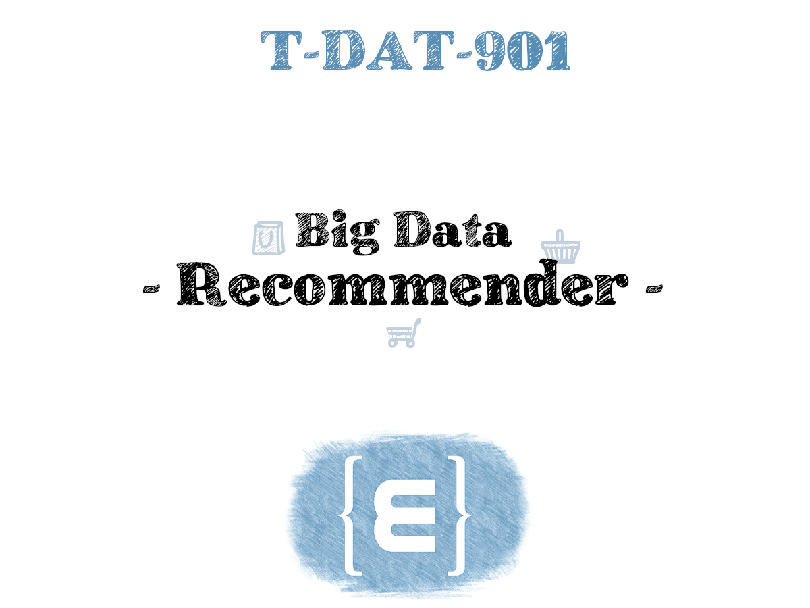
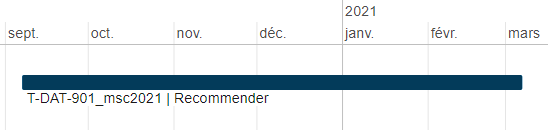
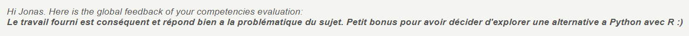

# Recommender - T-DAT-901

# Sommaire

- [Recommender - T-DAT-901](#recommender---t-dat-901)
- [Sommaire](#sommaire)
- [Presentation](#presentation)
- [Technologies](#technologies)
- [Environnement](#environnement)
  - [Dates](#dates)
  - [Temps à disposition](#temps-à-disposition)
  - [Projets en parallèle](#projets-en-parallèle)
- [Fonctionnalités](#fonctionnalités)
- [Equipe et répartition du travail](#equipe-et-répartition-du-travail)
  - [Membres de l'équipe](#membres-de-léquipe)
- [Notation](#notation)
- [Liens](#liens)

# Presentation

Projet de Big Data où il a fallu extraire des statistiques d'un dataset de 7 milions d'entrées d'achats de clients dans un magasin. Puis utiliser ces statistique pour réaliser des recommendations logique de produits pour chaque clients suivant leurs goûts, leur budget, etc.

# Technologies
* R

# Environnement
Semestre 9 *(premier semestre de M2)*

## Dates
* **Début :** 2020-09-07
* **Fin :** 2021-02-28

## Temps à disposition
**Nombre total de jours :** 35 (7 semaines; 1,75 mois)  
*Detail :*
* *Nombre de jours par semaine en cours : 1*
* *Nombre de semaines alternées : 20*
* *Nombre de semaines complètes en cours : 3*
* *Nombre de jours fériés : 0*

## Projets en parallèle 
* [T-ESP-900](https://github.com/HaberkornJonas/ManageMint_Frontend_T-ESP-900)
* [T-DAT-901](https://github.com/HaberkornJonas/Image-Recognition_T-DEV-810)

# Fonctionnalités
* L'utilisateur clique sur le bouton et formule sa requête. L'IA lui retourne le chemin le plus court pour réaliser son voyage en train

# Equipe et répartition du travail
**Nombre de commit total :** 67  
**Chef de projet :** Haberkorn Jonas  
**Documentation réalisée par :** Haberkorn Jonas  
**Diaporama de présentation réalisé par :** Haberkorn Jonas

## Membres de l'équipe
* **Haberkorn Jonas**
  * Etudiant à : Strasbourg
  * Nombre de commits : 50
  * Tâches implémentées :
    * Génération des statistiques
    * Clustering des profils
    * Recommendations
* **Kocaoz Ogün**
  * Etudiant à : Strasbourg
  * Nombre de commits : 11
  * Tâches implémentées : -
* **Sattler Sébastien**
  * Etudiant à : Strasbourg
  * Nombre de commits : 6
  * Tâches implémentées : -
* **Ibrahim Bila Maina Ari**
  * Etudiant à : Paris
  * Nombre de commits : 0
  * Tâches implémentées : -

# Notation
**Référent pédagogique** : Alexandre Teisseire (Paris)
  
**Proportion des compétences validé :** 100%    

**Retour pédagogique :**   

Feedback  

# Liens
* [Projet](project)
* [Sujets](documents/subject)
